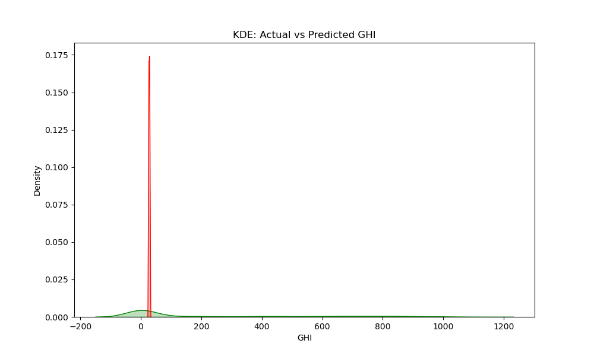
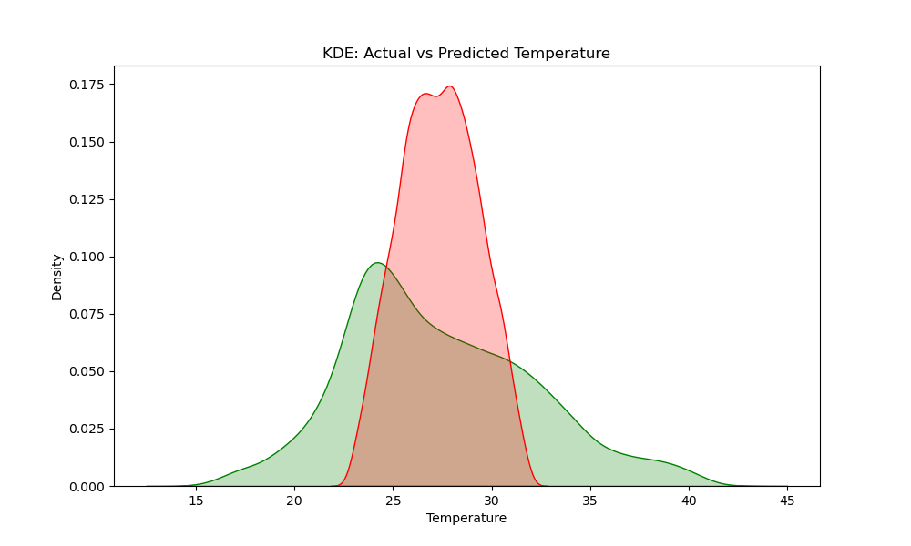
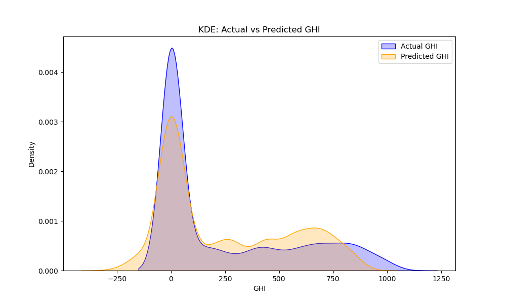
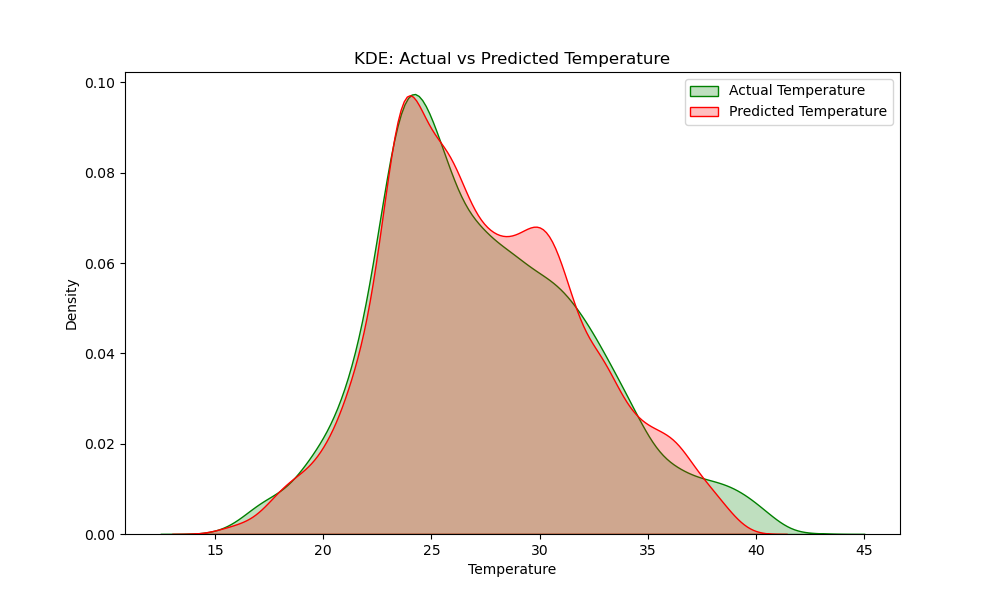
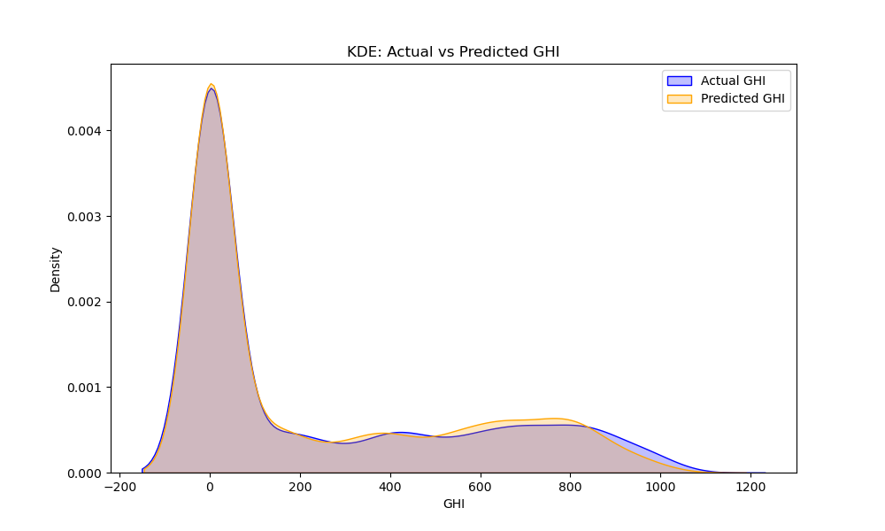
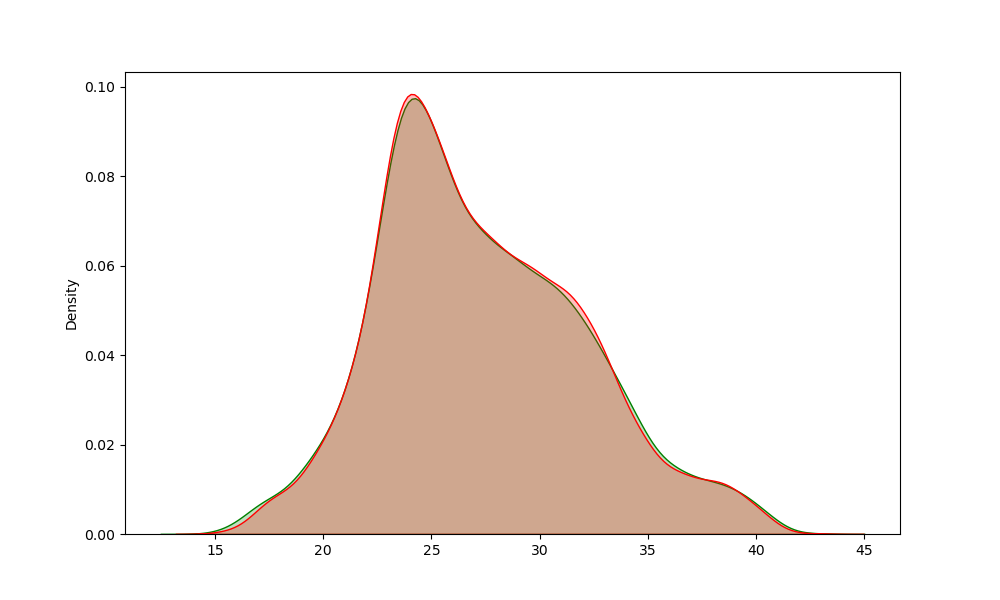

## Solarpanel Power Prediction using ML regression models :

Real-time ML-powered system designed to predict solar panel power output using multiple regression models. The system uses historical weather data from the NSRDB (https://nsrdb.nrel.gov/data-viewer), specific to your locality, to provide accurate and localized solar power forecasts. By analyzing key weather parameters like Temperature and Global Horizontal Irradiance (GHI), it ensures that the predictions reflect real-time weather conditions, delivering precise solar power generation estimates.

The system integrates three different regression models: Linear Regression, Random Forest, and Support Vector Regression (SVR).

### **System Architecture**  


 **My Locality - Random Forest Method - Grafana Dashboard**   <br><br>


---

## Installation Instructions

### Prerequisites
- **Python 3.11+**
- **PostgreSQL**
- **Grafana**

Install all packages using this : ```pip install numpy pandas scikit-learn matplotlib psycopg2```

### Step 1: Clone the Repository
```bash
git clone https://github.com/g-wtham/solar_power_prediction.git
cd solar_power_prediction
```

### Step 2: Set Up PostgreSQL
1. Create a PostgreSQL database:
    ```sql
    CREATE DATABASE solar_power_prediction;
    ```
2. Configure the database tables with the respective table names as per the in the `random_forest.py` file given.

### Step 3: Connect Python to Postgres using Psycopg2 package
1. Define postgres database username and password (default-username: postgress; password: root)
2. psycopg2 is used for postgres to python connection

### Step 4: Install Grafana and select the data source (select postgresql)
1. Install Grafana (https://grafana.com/grafana/download) and set up username and password (default username & password: admin)
2. Navigate to `locahost:3000`, select postgresql as the data source and build dashboards by selecting the corresponding tables from the connected pg database.
3. Toggle the `order` setting 'ON' and set _custom limit_, as default is 50 and can hinder if more data points are plotted.
4. You can export the dashboards as JSON files as well for preserving the templates for external sharing.

### Step 5: Run the System
1. Train the model:
   ```bash
   python random_forest.py 
   ```
2. For getting the plots & metrics for the model:
   ```bash
   python random_forest-metrics.py
   ```
3. Visualize Results in Grafana:
View the predictions on the Grafana dashboard (`localhost:3000`)

---
## Code Explanation :

_Data Preparation and Processing_

Visit NSRDB (https://nsrdb.nrel.gov/data-viewer) and enter your locality latitude & longitude coordinates. Choose the available dataset. You will receive a mail with the link to the dataset, valid for 24 hrs. Download before it expires!

The system begins by importing weather data from a CSV file containing historical measurements from 2017-2020. The preprocessing steps include:
- Cleaning data by replacing zero values with NaN
- Calculating non-zero means for accurate weightage
- Splitting data into five input features plus temperature and GHI as target variables

_Model Architecture_

1. Linear Regression Implementation
- Utilizes sklearn's LinearRegression for both temperature and GHI prediction
- Performance metrics include MAE, MSE, RMSE, and R-squared values
- Visualizes results through kernel density estimation plots

2. Support Vector Regression Enhancement
- Implements RBF kernel for capturing non-linear relationships
- Features standardization using StandardScaler for better model performance
- Includes inverse transformation to convert standardized predictions back to original scale

3. Random Forest Approach
- Uses ensemble learning with multiple decision trees
- Separate models for temperature and GHI predictions
- Provides better handling of complex non-linear relationships

_Prediction Pipeline_

Time Series Processing
- System generates predictions every 10 minutes
- Converts datetime components into feature vectors
- Processes year, month, day, hour, and minute as separate features and passes those into PostgreSQL database

Power Calculation Algorithm
The solar power calculation follows a specific formula:
1. Initial power factor calculation:  f = 0.18 × 7.4322 × GHI
2. Temperature difference: insi = Temperature - 25
3. Temperature coefficient: midd = 1 - 0.05 × insi
4. Final power output: Power = f × midd

Pass the power output value along with GHI, Temperature into the database.

Database Integration
- PostgreSQL database stores predictions
- Separate tables for each prediction method
- Stores timestamp, temperature, GHI, and calculated power
- Handles database connections with error management


Performance Visualization
- Implements kernel density estimation plots
- Compares actual vs predicted values for both temperature and GHI
- Provides visual assessment of model accuracy

## Prediction results visualized from various models, showcasing the actual vs. predicted values based on input parameters like GHI and Temperature.

Random Forest method performed better than linear regression and support regression model, as it captures the non-linearity of the dataset well. As the dataset contains more than 43,849 rows, SVR model struggles without performing additional preprocessing steps, while random forest achieves nearly 97.5% accuracy as R² score is 0.9755. Thus, out of 3 regression models, random forest gives us good performance to accuracy ratio.

### Random Forest Metrics :
_Temperature Metrics :_ <br>
Mean Absolute Error (MAE): 0.5528913519430765 <br>
Mean Squared Error (MSE): 0.5644339387885424 <br>
Root Mean Squared Error (RMSE): 0.7512881862431635 <br>
R-squared (R²): 0.9755113005363533 <br>

_GHI Metrics :_ <br>
Mean Absolute Error (MAE): 37.355814632366354 <br>
Mean Squared Error (MSE): 6452.568767013318 <br>
Root Mean Squared Error (RMSE): 80.32788287396424 <br>
R-squared (R²): 0.938099717335316 <br>

### **1. Linear Regression**

- **Actual vs Predicted GHI**  
  
  
- **Actual vs Predicted Temperature**  
  

_Temperature Metrics :_ <br>
Mean Absolute Error (MAE): 3.3499192136786125 <br>
Mean Squared Error (MSE): 19.45326539183867 <br>
Root Mean Squared Error (RMSE): 4.410585606451673 <br>
R-squared (R²): 0.1559948170555182 <br>

_GHI Metrics :_ <br>
Mean Absolute Error (MAE): 239.01596615620102 <br>
Mean Squared Error (MSE): 148356.77895149155 <br>
Root Mean Squared Error (RMSE): 4.410585606451673 <br>
R-squared (R²): -0.42320475517690825 <br>

### **2. Support Vector Regression (SVR)**

- **Actual vs Predicted GHI**  
  

- **Actual vs Predicted Temperature**  
  

_Temperature Prediction Metrics:_ <br>
Mean Absolute Error (MAE): 1.1168709530280416 <br>
Mean Squared Error (MSE): 2.1421797747223588 <br>
Root Mean Squared Error (RMSE): 1.4636187258717206 <br>
R-squared (R²): 0.9070587484287838 <br>

_GHI Prediction Metrics:_ <br>
Mean Absolute Error (MAE): 76.64484043904731 <br>
Mean Squared Error (MSE): 11821.021878633164 <br>
Root Mean Squared Error (RMSE): 108.72452289448395 <br>
R-squared (R²): 0.8865994889642227 <br>

### **3. Random Forest**

- **Actual vs Predicted GHI**  
  

- **Actual vs Predicted Temperature**  
  

### **4. Grafana Dashboard**

 **All methods dashboard** <br>
  


